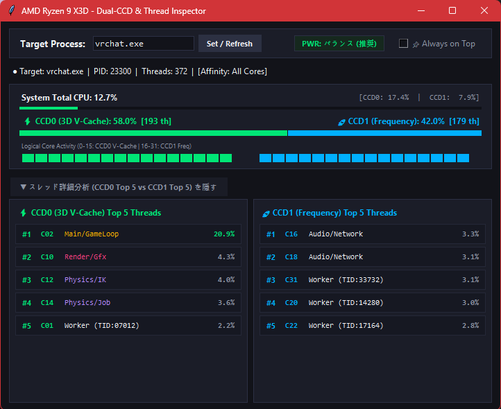
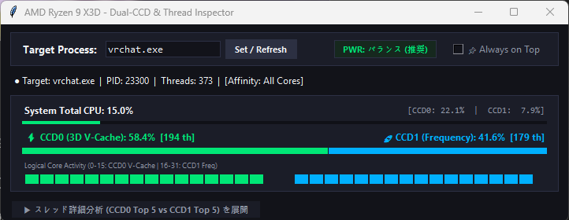

# AMD Ryzen X3D - Dual-CCD & Thread Inspector

🌐 **[English](README.md)** | **[日本語](README.ja.md)**

---

**AMD Ryzen 9 7950X3D / 9950X3D** などのデュアルCCD構成（**CCD0: 3D V-Cache** / **CCD1: Frequency**）に最適化された、リアルタイム・プロセッサ＆スレッド診断ツールです。

VRChatなどのVR環境や高負荷ゲームにおいて、**「メイン描画や物理演算が本当に 3D V-Cache（CCD0）に乗っているか」**、**「音声や通信などのサブ処理が 高クロック（CCD1）にうまく逃げてヘッドルームを確保できているか」** を安全かつ視覚的に検証できます。

---

## 主な特徴

* **100% アンチチートセーフ（完全無害）**
  * Easy Anti-Cheat (EAC) や BattlEye などの保護下にあるゲームでもブロックされません。
  * メモリ改ざんやインジェクションは一切行わず、Windows標準の安全な情報取得APIのみを使用しています。
* **高精度なスレッド役割の推定**
  * OS起動時に最初に生成された Primary Thread を厳密特定（`Main/GameLoop` 確証度100%）。
  * CPUサイクル消費順位に基づき、`Render/Gfx`（描画）、`Physics/IK`（物理・PhysBones）、`Audio/Network`（音声・通信）などを自動分類。
* **CCD0 Top 5 vs CCD1 Top 5 の並列インスペクター**
  * 左右2カラムで各CCDの主力スレッド5本（計10本）をリアルタイム追跡。
  * コア間を移動（マイグレーション）したスレッドには **`⇄`（オレンジ色マーク）** が点灯。
* **🖥️ PC全体のCPU使用率 ＆ CCD別（CCD0 / CCD1）使用率の常時表示**
  * PC全体（System Total）のCPU使用率に加え、CCD0（V-Cache側）とCCD1（Freq側）それぞれの全体負荷率をリアルタイム計測。ゲーム単体の負荷配分とシステム全体の負荷を対比して俯瞰できます。
* **連動リサイズ対応の折りたたみUI**
  * 「スレッド詳細を隠す」ボタンを押すと、**ウィンドウが自動でコンパクト（高さ250px）に縮小**。
  * 展開すると大画面（高さ560px）の詳細ダッシュボードに戻ります。
* **⚡ 電源プラン（Power Plan）の常時監視バッジ**
  * 現在のWindows電源プラン（「バランス」など）をリアルタイム表示。X3Dのコアパーキングが無効化される「高パフォーマンス」等に誤って切り替わった場合、警告色で即座に通知します。
* **🎯 プロセス優先度（Priority Class）の常時表示**
  * 対象プロセスがどの優先度（`通常` / `高` / `通常以上` 等）で実行されているかをリアルタイム表示。起動オプション（`--process-priority`）などが実際に反映されているかを即座に確認できます。
* **📌 Always on Top（常時最前面）切り替え**
  * 普段はチェックを外して普通のウィンドウとして背面に回せます。

---

## 画面イメージ

### 1. 詳細展開モード（大画面）



> **実測例（VRChat 高負荷ワールド動作時）**:
> 3D V-Cache 搭載の **CCD0** に `Main/GameLoop` や `Render/Gfx`、`Physics/IK` などの重要描画・物理演算スレッドが集約され、高クロックの **CCD1** に `Audio/Network` やワーカースレッドが綺麗にオフロードされている様子が明確に確認できます。

<details>
<summary>テキスト版 UI アスキーアートを表示</summary>

```text
┌──────────────────────────────────────────────────────────────────────────┐
│ AMD Ryzen 9 X3D - Dual-CCD & Thread Inspector                     — □ ✕ │
├──────────────────────────────────────────────────────────────────────────┤
│ Target: [ vrchat.exe   ] [ Set ]  [PWR: バランス (推奨)]    [x] Always on Top│
│ ● Target: vrchat.exe  |  PID: 18420  |  Threads: 68  |  [Affinity: All Cores]│
├──────────────────────────────────────────────────────────────────────────┤
│ 🖥️ System Total CPU: 24.5%          [CCD0: 38.2%  |  CCD1: 10.8%]       │
│ [██████████████░░░░░░░░░░░░░░░░░░░░░░░░░░░░░░░░░░░░░░░░░░░░░░░░░░░░░░░░░░]│
│ ⚡ Target CCD0 (V-Cache): 61.2% [38th]      🚀 Target CCD1 (Freq): 38.8% [30th]│
│ [██████████████████████░░░░░░]             [██████████████░░░░░░░░░░░░░░]│
│ Logical Core Activity (0-15: CCD0 V-Cache | 16-31: CCD1 Freq)             │
│ ■■■■■■■■ ■■■■■■■■   ■■■■■■□□ □□□□□□□□                                    │
├──────────────────────────────────────────────────────────────────────────┤
│ [▼ スレッド詳細分析 (CCD0 Top 5 vs CCD1 Top 5) を隠す]                   │
├────────────────────────────────────┬─────────────────────────────────────┤
│ ⚡ CCD0 (3D V-Cache) Top 5 Threads │ 🚀 CCD1 (Frequency) Top 5 Threads   │
│                                    │                                     │
│ #1 C02  Main/GameLoop   20.9%      │ #1 C16  Audio/Network  3.3%         │
│ #2 C10  Render/Gfx       4.3%      │ #2 C18  Audio/Network  3.1%         │
│ #3 C12  Physics/IK       4.0%      │ #3 C31  Worker         3.1%         │
│ #4 C14  Physics/Job      3.6%      │ #4 C20  Worker         3.0%         │
│ #5 C01  Worker           2.2%      │ #5 C22  Worker         2.8%         │
└────────────────────────────────────┴─────────────────────────────────────┘
```
</details>

### 2. コンパクトモード（折りたたみ時）



<details>
<summary>テキスト版 UI アスキーアートを表示</summary>

```text
┌──────────────────────────────────────────────────────────────────────────┐
│ AMD Ryzen 9 X3D - Dual-CCD & Thread Inspector                     — □ ✕ │
├──────────────────────────────────────────────────────────────────────────┤
│ Target Process: [ vrchat.exe          ] [ Set / Refresh ]  [ ] Always on Top │
│ ● Target: vrchat.exe  |  PID: 23300  |  Threads: 373 |  [Affinity: All Cores]│
├──────────────────────────────────────────────────────────────────────────┤
│ System Total CPU: 15.0%                    [CCD0: 22.1%  |  CCD1: 7.9%] │
│ ⚡ CCD0 (3D V-Cache): 58.4%  [194 th]       🚀 CCD1 (Frequency): 41.6% [179 th]│
│ [██████████████████████░░░░░░]             [██████████████░░░░░░░░░░░░░░]│
│ Logical Core Activity (0-15: CCD0 V-Cache | 16-31: CCD1 Freq)             │
│ ■■■■■■■■ ■■■■■■■■   ■■■■■■■■ ■■■■■■■■                                    │
├──────────────────────────────────────────────────────────────────────────┤
│ [▶ スレッド詳細分析 (CCD0 Top 5 vs CCD1 Top 5) を展開]                   │
└──────────────────────────────────────────────────────────────────────────┘
```
</details>

---

## 使い方

### A. Python環境で直接動かす場合
Python 3.10以上がインストールされていれば、追加のパッケージ（pip等）は不要です。
```bash
python ccd_monitor.py
# または start_monitor.bat をダブルクリック
```

### B. 単体 EXE をビルドする場合（PyInstaller）
```bash
pip install pyinstaller
pyinstaller --noconsole --onefile --clean --name "X3D-Thread-Inspector" ccd_monitor.py
```
`dist/X3D-Thread-Inspector.exe` が生成されます。

---

## GitHub Actions 自動ビルド

このリポジトリを GitHub にプッシュすると、GitHub Actions により自動的に Windows 用の単体 `.exe` がビルドされます。

1. **Actions タブ**: すべての Push / PR でビルド成果物（Artifact）としてダウンロード可能。
2. **Releases**: GitHub Release ページに自動でバージョンがカウントアップ（`v0.0.1` → `v0.0.2`...）され、最新の `X3D-Thread-Inspector.exe` および ZIP パッケージが自動公開されます。

---

## ライセンス
MIT License
