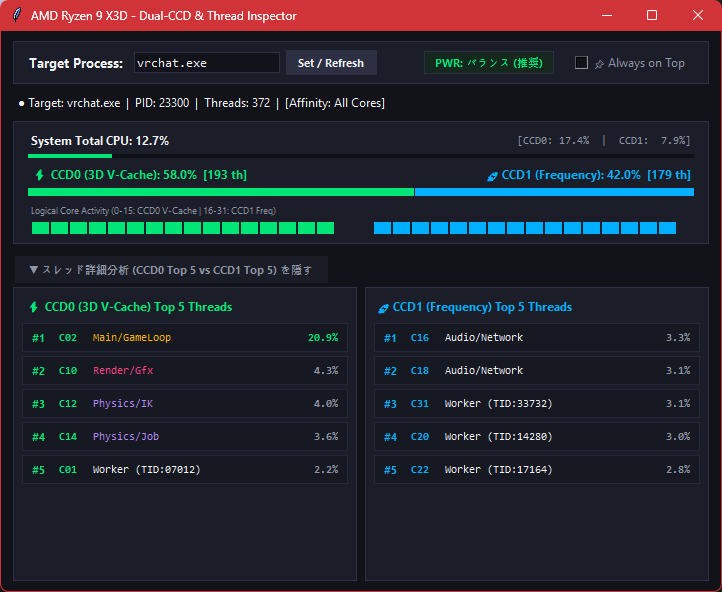
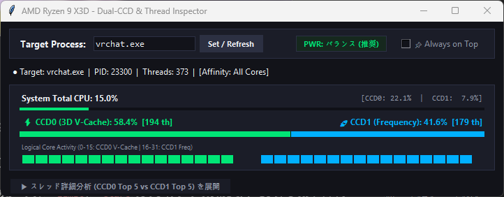

# AMD Ryzen X3D - Dual-CCD & Thread Inspector

🌐 **[English](README.md)** | **[日本語](README.ja.md)**

---

A real-time processor and thread diagnostics tool tailored for dual-CCD AMD processors such as the **AMD Ryzen 9 7950X3D / 9950X3D** (**CCD0: 3D V-Cache** vs **CCD1: Frequency**).

Designed specifically for heavy multitasking environments (like VRChat, SteamVR, and modern games), this tool lets you verify whether **latency-sensitive rendering and physics workloads are safely hosted on 3D V-Cache (CCD0)** while **background tasks, audio, and network threads are offloaded to the high-frequency cores (CCD1)** to preserve critical headroom against stutter.

---

## Key Features

* **100% Anti-Cheat Safe (Zero-Risk)**
  * Fully safe to run alongside games protected by Easy Anti-Cheat (EAC), BattlEye, Vanguard, etc.
  * No memory injection, hooking, or intrusive DLL scans. Strictly queries safe, non-invasive Windows API performance metrics.
* **High-Accuracy Thread Role Estimation**
  * Accurately pinpoints the process's initial **`Main/GameLoop`** thread (Primary Thread: 100% certainty).
  * Automatically classifies active threads (`Render/Gfx`, `Physics/IK`, `Audio/Network`, `Worker`) based on real-time CPU cycle consumption ranks.
* **Dual-CCD Parallel Inspector (CCD0 Top 5 vs CCD1 Top 5)**
  * Side-by-side inspection of the top 5 heaviest threads on each CCD.
  * Instant visual indicators (**`⮀` orange icon**) whenever a thread migrates between logical cores.
* **🖥️ System Total CPU & Per-CCD System Usage Live Gauges**
  * Displays overall PC-wide CPU utilization alongside individual CCD0 (V-Cache) and CCD1 (Freq) total loads in real time, letting you easily correlate the target game's distribution with full system activity.
* **Dynamic Auto-Resizing & Collapsible UI**
  * Click the collapse button to automatically shrink the window height down to a compact **250px HUD**.
  * Expand anytime into a full **560px detailed diagnostic dashboard**.
* **⚡ Live Power Plan Badge & Warnings**
  * Displays active Windows power plan (e.g. `Balanced`). Instantly alerts you if switched to `High Performance` which inadvertently disables core parking on dual-CCD Ryzen processors.
* **📌 Always on Top Toggle**
  * Easily toggle always-on-top mode on or off to send the window behind other applications when needed.

---

## Preview

### 1. Expanded Diagnostic Mode (Full Dashboard)

> **Real-World Inspection (VRChat under heavy load)**:
> Core gaming workloads (`Main/GameLoop`, `Render/Gfx`, and `Physics/IK`) are cleanly packed into the 3D V-Cache on **CCD0**, while background tasks (`Audio/Network`, worker threads) are offloaded onto high-frequency **CCD1**.

### 2. Compact HUD Mode (Collapsed)


---

## How to Run

### A. Run directly with Python
Requires Python 3.10 or newer (Standard library only; no pip dependencies required to run):
```bash
python ccd_monitor.py
# Or double-click start_monitor.bat
```

### B. Build Standalone EXE Locally (PyInstaller)
```bash
pip install pyinstaller
pyinstaller --noconsole --onefile --clean --name "X3D-Thread-Inspector" ccd_monitor.py
```
Outputs standalone executable to `dist/X3D-Thread-Inspector.exe`.

---

## Automated CI/CD (GitHub Actions)

This repository includes a ready-to-use GitHub Actions workflow (`.github/workflows/build.yml`):

* **Every push to `main`**: Automatically builds on a clean Windows runner, tags a new version (`v0.0.1` → `v0.0.2`...), and publishes a GitHub Release with standalone `.exe` and `.zip` packages.
* **Manual trigger**: You can trigger a release with `patch`, `minor`, or `major` version bumps directly from the GitHub Actions tab.

---

## License
MIT License
